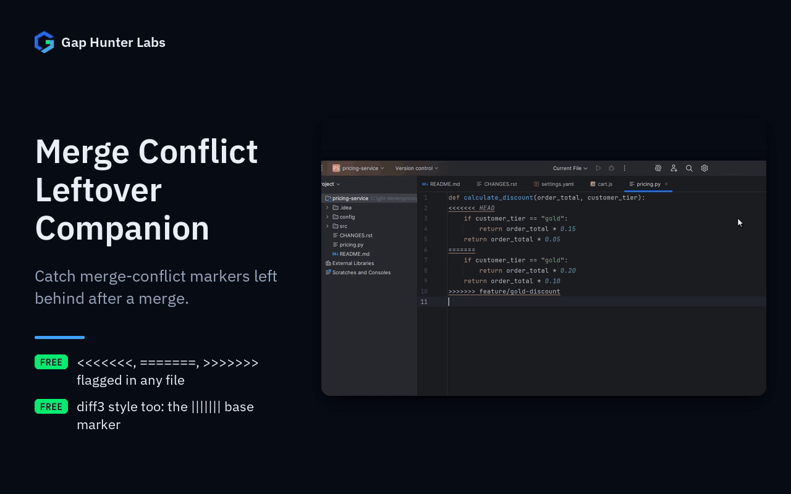

# Merge Conflict Leftover Companion

Flags real Git merge-conflict markers (`<<<<<<<`, `|||||||`,
`=======`, `>>>>>>>`) left behind in any file — a real, distinct
problem from an *active* unresolved merge (which the IDE's own Commit
window already flags in red): a merge that was already resolved and
committed, but with the markers themselves accidentally left in the
file. Covers both the standard 3-way conflict style and the `diff3`/
`zdiff3` style (the `|||||||` common-ancestor section, recommended as
Git's default `merge.conflictStyle` since Git 2.35).



Each feature on its own:
[Leftover markers](docs/media/01-leftover-markers.gif) ·
[diff3, any file](docs/media/02-diff3-any-file.gif)

## Why it exists

This is a real, recurring mistake — a quick web search for "detect git
conflict markers" turns up multiple independent blog posts and CI
scripts written specifically to catch this after the fact, confirming
it's a known problem, not an imagined one. Once the merge is committed,
nothing in the IDE names a leftover marker for what it is: depending on
the language you get a generic syntax error on that line (YAML, for
example) or nothing at all (a Markdown file, a plain-text file, a YAML
value).

## Why built this way

- **100% plain-text scan, any file type.** No PSI-per-language
  dependency, no network calls — registered without a `language`
  filter, same pattern as `env-var-missing-companion`.
- **The warning covers the whole marker line, in any file type.** It is
  anchored to the file with the line's exact range, not to whatever
  token the language's lexer produced there: before 0.2.2, in YAML the
  `|||||||` and `>>>>>>>` lines (which start with a one-character
  block-scalar token) were silently skipped.
- **Favors recall, with one deliberate exception.** A `<<<<<<<` or
  `>>>>>>>` line is always flagged, including documentation that cites
  the literal syntax as an example — an accepted trade-off rather than
  risk hiding a genuine leftover marker behind an imperfect filter.
  The exception: a line of exactly seven `=` is also how Markdown
  (setext) and reStructuredText underline a 7-letter title ("License",
  "Changes", "Install"), so `=======` and `|||||||` are only flagged in
  a file that also has a `<<<<<<<` or `>>>>>>>` line. A leftover where
  both angle-bracket lines were deleted and only the separator was kept
  is not caught.

## Usage

Open any file. A leftover conflict marker shows as an inline warning.

## Support

- **Bugs and feature requests:** [GitHub Issues](https://github.com/GapHunterLabs/merge-conflict-leftover-companion/issues)
- **Questions, or custom rules for a team's codebase:** **gaphunterlabs@gmail.com**
- **Security vulnerabilities:** report privately as described in [SECURITY.md](SECURITY.md), not in a public issue.
- **Privacy and network behavior:** [PRIVACY.md](PRIVACY.md)

## Development

```
./gradlew test           # unit tests
./gradlew buildPlugin    # generates build/distributions/*.zip
./gradlew verifyPlugin   # checks compatibility against real IDEs
```

## License

Apache-2.0. See `LICENSE`.
